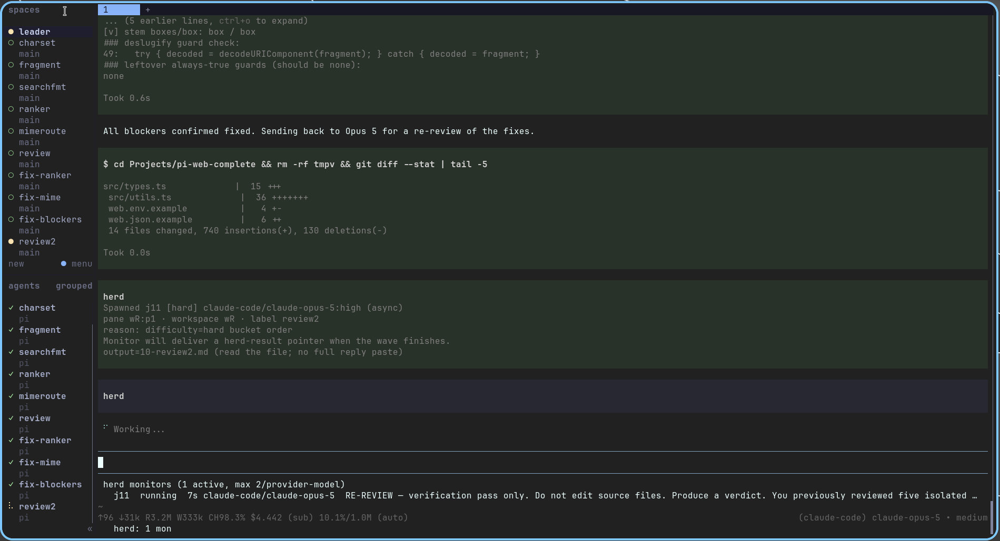

# pi-herdr

**Pi extension for Herdr-visible subagent herds — local-first preference, single-stream local seat, and difficulty-based model routing.**

Markdown handoff runs, exclusive write lanes, and a structured `herdr` tool for terminal control.



**Design intent**

| Role | Who |
| ---- | --- |
| Orchestration / multi-task / review | Frontier model (parent session) |
| Single discrete tasks | **Local seat** — private, free, `maxStreams: 1`, clean per-job context |
| User view / permissions | [Herdr](https://herdr.dev) panes (watch, focus, accept) |

Requires running **inside [Herdr](https://herdr.dev)** (`HERDR_ENV=1`). Outside Herdr, `herd` still loads for config/status, but spawn/boot and the `herdr` tool are inactive.

## Install

```bash
pi install npm:@itc-steve/pi-herdr
```

From a local checkout:

```bash
pi install /path/to/pi-herdr
```

Then `/reload`. Use `/herd help` for slash usage.

**Do not** install other herdr packages at the same time (e.g. `@ogulcancelik/pi-herdr`, `pi-custom-herdr`). This package vendors the `herdr` tool and **refuses to load** if a known competitor appears in Pi settings.

## Requirements

- [Pi coding agent](https://github.com/earendil-works/pi)
- [Herdr](https://herdr.dev) (terminal workspace / agent multiplexer)
- Models listed in config must already be available to Pi (local vLLM, Claude Code, Grok CLI, etc.)

## Config

Copy [herd.json.example](./herd.json.example) to `~/.pi/agent/herd.json` (created automatically on first `models` / `run` if missing):

```json
{
  "sessionDir": "~/.pi/agent/herd",
  "maxModelConcurrent": 2,
  "local": {
    "enabled": true,
    "model": "vllm/Qwen/Qwen3.6-27B-FP8",
    "thinking": "medium",
    "maxStreams": 1,
    "preflight": true,
    "preferOn": ["easy", "medium"],
    "whenFull": "queue"
  },
  "easy": [
    { "model": "vllm/Qwen/Qwen3.6-27B-FP8", "thinking": "medium", "local": true },
    { "model": "claude-code/claude-sonnet-5", "thinking": "medium" }
  ],
  "medium": [
    { "model": "grok-cli/grok-build", "thinking": "medium" }
  ],
  "hard": [
    { "model": "grok-cli/grok-4.5", "thinking": "high" },
    { "model": "claude-code/claude-opus-4-8", "thinking": "high" }
  ],
  "defaults": {
    "isolation": "none",
    "timeoutMs": 600000,
    "waitForReply": false,
    "requireOutput": true,
    "resultDelivery": "pointer",
    "triggerTurnOnResult": true
  }
}
```

Edit model ids to match your Pi providers.

### Field reference

| Field | Meaning |
| ----- | ------- |
| `sessionDir` | Run root (`runs/`, journals, session JSONL) |
| `maxModelConcurrent` | Cap on in-flight monitored jobs **per exact provider/model** |
| `local` | Single-stream seat: model id, `maxStreams` (default 1), optional preflight |
| `local.preferOn` | Difficulties that try local first when free (default `easy`+`medium`) |
| `local.whenFull` | `queue` = wait for free local seat (default); `overflow` = next catalog model |
| `easy` / `medium` / `hard` | Ordered model catalogs; first free match wins |
| `defaults.isolation` | `none` (shared tree + `owns=`) or `worktree` |
| `defaults.requireOutput` | Async spawn must declare `output=` |
| `defaults.resultDelivery` | `pointer` (default: path only) or `full` (paste reply) |
| `defaults.triggerTurnOnResult` | One parent turn when the last in-flight job finishes (default true) |

The `local` block is a **concurrency policy** (one stream, clean context) — usually a private GPU, but any model tagged `"local": true` can own the seat.

### Escape hatches

```json
"local": { "whenFull": "overflow" }           // paid parallel when local busy
"local": { "preferOn": ["easy"] }             // medium stays remote-only
"defaults": { "resultDelivery": "full" }      // embed full reply in herd-result
"defaults": { "triggerTurnOnResult": false }  // display only; no auto parent turn
```

## How it works

### Difficulty routing (bottom-up)

| Difficulty | Use for | Routing |
| ---------- | ------- | ------- |
| **easy** | **Default** single discrete tasks | Local first when free (`preferOn`); then `whenFull` queue or overflow |
| **medium** | Multi-file bulk with disjoint write lanes | Local first when free (default `preferOn`); else catalog |
| **hard** | Architecture, critique, VERIFY — **not** the default implementer | Frontier catalog only (unless `preferOn` includes hard) |

**Never** dump a whole project on one `difficulty=hard` spawn. Decompose; promote only when needed. Local busy does **not** escalate difficulty — it queues or overflows inside the same bucket.

Default single-file / summarize / scaffold work to **`difficulty=easy`**. Keep the parent on a frontier model for orchestration; herd workers do the narrow work with clean per-job sessions.

### Local seat (private + free)

1. Free seat → local boots first on every difficulty in `preferOn`.
2. `whenFull: "queue"` (default) → extra jobs **wait** for the local GPU (serial free compute; no cloud tokens).
3. `whenFull: "overflow"` → extra jobs take the next catalog model (paid parallel).
4. Each job gets a **fresh** `sessions/<job>.jsonl` so the local model never juggles multiple tasks in one context.
5. Do not pass `model=` for the local model on more than `maxStreams` jobs.

### Handoff runs

```text
~/.pi/agent/herd/runs/<date>_<slug>/
  instruction.md   context.md   plan.md   progress.md
  meta.json   journal.jsonl
  sessions/<job>.jsonl
  jobs/…
  <your output=.md files>
```

Shared context is **markdown only** — panes do not chat to each other. Panes stay open after success so you can watch or intervene in Herdr.

### Write lanes

Multi-writer fan-out requires disjoint `owns=` (and optional `forbid=`). Put **Parallel lanes** in `plan.md` first; the tool rejects overlapping owners.

### Completion (pointer batching)

Async jobs are monitored in the background.

- Mid-wave: footer only (`herd: N mon +local M`) — **no** parent turn.
- When the **last** in-flight job finishes: **one** batched `herd-result` with short **pointers** (`output=path`), not full reply pastes.
- Parent should **read the artifact** if it needs content — do not reassess the whole task from a pointer.
- Use `herd wait` / `herd collect` for a sync barrier. Set `resultDelivery=full` only if you need reply bodies in-session.

## Tools

| Tool | Role |
| ---- | ---- |
| `herd` | Assign / abort / steer / status difficulty-routed subagents |
| `herdr` | View and control Herdr terminals (workspaces, tabs, panes, worktrees) |

**Rule:** assign work with `herd`. Use `herdr` to view/focus/read — never `herdr run` into a herd job pane to assign work.

### `herd` actions

| Action | Purpose |
| ------ | ------- |
| `models` | Show catalog + local stream use / queue / delivery defaults |
| `status` | Active monitors / local seats |
| `run` | `create` / `list` / `use` / `show` handoff folders |
| `spawn` | Boot a pane, submit task (`difficulty=` required; async needs `output=`) |
| `steer` / `abort` | Nudge or stop a job |
| `wait` / `collect` | Block until idle / harvest reply |
| `close` / `reset` | Close panes / clear monitors |
| `journal` | Soft resume log for the active run |

### Quick flow

```text
herd run create name=demo goal="Summarize this repo"
herd spawn difficulty=easy task="Fill context.md from the repo" output=context.md
herd spawn difficulty=medium task="Implement src/client.ts" output=progress-core.md owns=src/client.ts
herd spawn difficulty=hard task="Review progress-*.md; note gaps" output=progress-review.md
```

Exact model override still requires difficulty:

```text
herd spawn difficulty=easy model=claude-code/claude-sonnet-5 task="…" output=notes.md
```

### Slash

```text
/herd help
/herd models
/herd status
/herd run create name=<slug> goal="…"
/herd spawn difficulty=easy task="…" output=file.md
```

### `herdr` (view / control)

Registered only when `HERDR_ENV` and `HERDR_PANE_ID` are set (Herdr-managed pane). Actions include workspace/tab/pane lifecycle, `read` / `watch` / `wait_agent`, `run` / `send` / `stop`, worktrees, and notifications. Prefer friendly aliases or ids from `herdr list` — never invent pane ids.

## Skills

Package skills (`herd`, `herdr`) teach the launcher the bottom-up / local-first mindset and the herd vs herdr split. They install with the package via the Pi `skills` manifest.

## Footer status

While monitors or local streams are active: `herd: N mon +local M`. Hidden when idle.

## Development

```bash
npm test
```

Tests use Node’s built-in runner with `--experimental-strip-types` (Node ≥ 18).

## Changelog

See [CHANGELOG.md](./CHANGELOG.md).

## License

MIT. See [LICENSE](./LICENSE).
